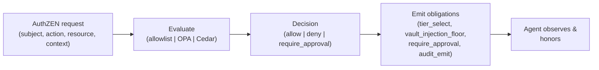

# policy-engine

[](LICENSE)
[](go.mod)
[](https://github.com/tkdtaylor/policy-engine/commits)

**Out-of-process authorization for autonomous agents.** You hand it a decision request; it
returns `allow`, `deny`, or `require_approval` — reached only over IPC so a compromised agent
cannot self-grant. It gates execution before [exec-sandbox](https://github.com/tkdtaylor/exec-sandbox) runs,
selects the isolation tier, and may raise (never lower) [vault](https://github.com/tkdtaylor/vault)'s
credential injection floor.

It's a **composable block** in the [Secure Agent Ecosystem](https://github.com/tkdtaylor/agent-builder#the-building-blocks) — one piece of the security seams, not a framework. The decision contract is [OpenID AuthZEN](https://openid.net/wordpress-content/uploads/2024/10/openid-authzen-specification-1_0.pdf)-shaped so OPA, Cedar, or OpenFGA can sit behind it. Part of a series licensed Apache-2.0.

> **Status.** v0 (`allowlist` evaluator) ships; v1 adds OPA and Cedar backends
> (`--evaluator opa|cedar`), risk scoring, and `require_approval` gating — all shipped. Remaining work
> is obligation enforcement end-to-end with consumer blocks. See the [roadmap](docs/plans/roadmap.md).

## Contents

- [Quick start](#quick-start)
- [How it works](#how-it-works)
- [Decision tiers](#decision-tiers)
- [Develop locally](#develop-locally)
- [Tech stack](#tech-stack)
- [Sponsorship](#sponsorship)
- [Enterprise support](#enterprise-support)
- [License](#license)

## Quick start

The fastest way to see it work needs only a Go compiler:

```bash
git clone https://github.com/tkdtaylor/policy-engine && cd policy-engine
go build ./... && go test ./...

go run . decide --allow api.example.com --host api.example.com
# Output: { "decision": "allow", "context": { ... } }

go run . decide --allow api.example.com --host evil.example.net
# Output: { "decision": "deny", "context": { "reason": "host not allowlisted" } }
# Exit code: 1
```

To run the server on a Unix socket and ask it decisions over IPC:

```bash
go run . serve --socket /tmp/policy.sock --allow api.example.com &
# Send: { "op": "decide", "request": { "subject": {...}, "action": {...}, "resource": {...}, "context": {...} } }
# Recv: { "decision": "allow", "context": { "reason": "...", "obligations": [...] } }
```

See [docs/CONTRACT.md](docs/CONTRACT.md) for the full AuthZEN request/response shape.

## How it works

You submit an AuthZEN request (subject, action, resource, context). The policy-engine evaluates it
against the configured backend — allowlist, OPA, or Cedar — and returns a decision plus any
obligations the agent must honor.



The key properties:

- **Out-of-process only.** The agent reaches the engine solely over IPC (Unix socket). There is no
  in-process `decide()` the agent can call to flip its own decision.
- **Fail-closed.** Unknown action, malformed request, or evaluation error → `deny`. The default
  posture is denial.
- **AuthZEN seam stays clean.** The request/response contract is engine-agnostic. No OPA-specific
  or Cedar-specific type leaks through.
- **Raise-only injection floor.** The `vault_injection_floor` obligation may raise vault's floor
  from `env` to `proxy`, never lower it.

Deeper detail: [architecture overview](docs/architecture/overview.md),
[diagrams](docs/architecture/diagrams.md), and the [spec](docs/spec/SPEC.md).

## Decision tiers

policy-engine returns one of three decisions:

| Decision | Meaning | Agent action |
|----------|---------|--------------|
| `allow` | The request is authorized. Proceed. | Execute the action as requested. |
| `deny` | The request is not authorized. Stop. | Escalate to operator; do not execute. |
| `require_approval` | The request needs human sign-off before execution. | Pause and escalate. |

Obligations further refine the allow:

| Obligation | Meaning |
|-----------|---------|
| `tier_select` | exec-sandbox runs at this isolation tier (bubblewrap, gvisor, firecracker). |
| `vault_injection_floor` | vault injects credentials at this floor (env or proxy). |
| `audit_emit` | Emit a full decision trace to audit-trail. |

## Develop locally

```bash
go test ./...                 # tests
go build ./...                # compile
make check                    # the verification gate: lint + test + build
```

Supporting evaluator backends:

```bash
# Allowlist (v0 default)
go run . decide --evaluator allowlist --allow api.example.com --host api.example.com

# OPA/Rego
go run . decide --evaluator opa --allow api.example.com --host api.example.com

# Cedar
go run . decide --evaluator cedar --allow api.example.com --host api.example.com
```

Server with caching and rate limiting:

```bash
go run . serve --socket /tmp/policy.sock --evaluator opa --cache-ttl 5s --rate-limit 100
```

Contributing runs through a test-spec-first, one-task-one-branch workflow. Read
[AGENTS.md](AGENTS.md) (the canonical briefing) and
[CONTRIBUTING.md](CONTRIBUTING.md) before starting; tasks and their specs live under
[docs/tasks/](docs/tasks/).

## Tech stack

Go 1.26 — static binary, no runtime dependencies in v0. OPA and Cedar are embedded (vendored Go
libraries). The IPC server uses only the standard library (`net`, `encoding/json`).

## Sponsorship

policy-engine is independent, open-source security tooling. If it saves you time or risk, [sponsoring its development](https://github.com/sponsors/tkdtaylor) is the most direct way to keep it maintained.

## Enterprise support

Commercial support, integration help, and SLAs are available. Apache-2.0 means you can build on policy-engine freely; paid support is a partner if you want one, never a requirement. Contact [tools@taylorguard.me](mailto:tools@taylorguard.me).

## License

[Apache License 2.0](LICENSE) — consistent with the Secure Agent Ecosystem. See [NOTICE](NOTICE)
for attribution and disclaimers, and [CONTRIBUTING.md](CONTRIBUTING.md) for the inbound=outbound
/ DCO contribution terms.
