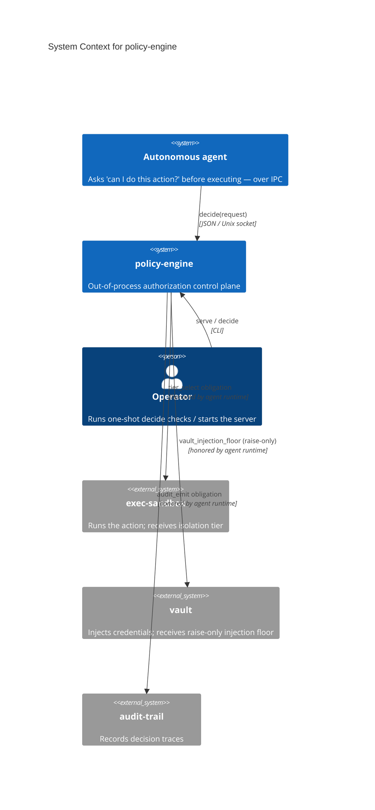
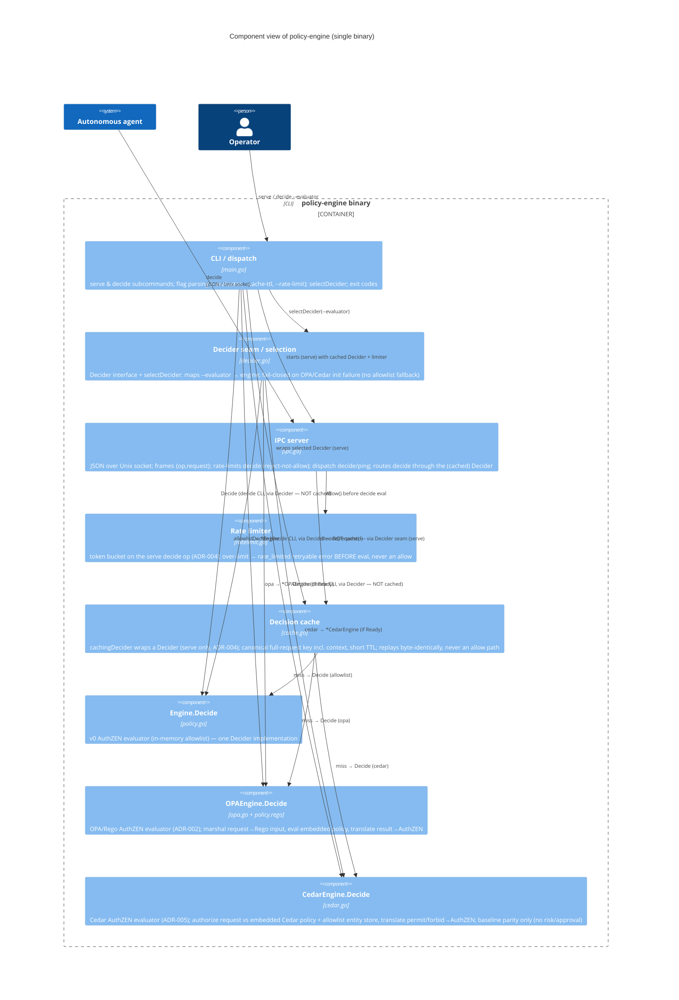
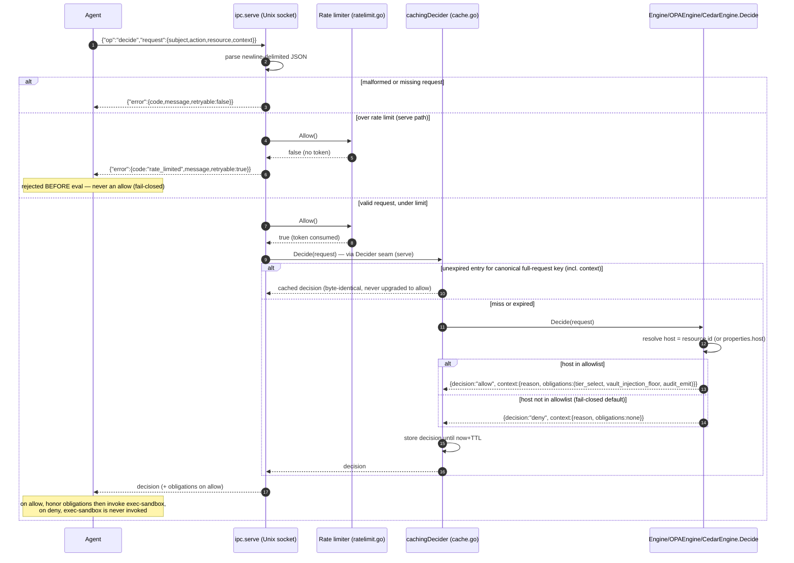

# Architecture Diagrams — policy-engine

**Last updated:** 2026-06-21 (task 006 — Cedar as a third evaluator behind the Decider seam, baseline parity, ADR-005)

C4-structured Mermaid diagrams plus the primary runtime sequence. See
[overview.md](overview.md) for prose context, [decisions/](decisions/) for the ADRs referenced
here, and [`../spec/architecture.md`](../spec/architecture.md) for the structured element catalog
these diagrams render.

These diagrams are part of the **authoritative spec**. Code changes that contradict a diagram
either invalidate the change or the diagram; one must be updated to match the other in the same commit.

> policy-engine is a single deployable binary with one external integration class per obligation
> (vault, exec-sandbox, audit-trail). Container and Component collapse into one diagram.

---

## 1. System Context — who uses it and what it touches

Note: policy-engine does not call vault / exec-sandbox / audit-trail directly — it emits
**obligations** in the decision that the agent's runtime is contractually bound to honor before
or while executing. The edges above are the obligation flow, not direct RPC.

---

## 2. Containers & Components — inside the binary

> One deployable unit (the static Go binary). The load-bearing components a contributor touches first:

**Key contracts**
- `Decide(map[string]any) -> map[string]any` is the **AuthZEN adapter seam** (ADR-001 §3). Three
  implementations exist behind it — the in-memory `Engine`, the OPA/Rego `OPAEngine` (ADR-002), and
  the Cedar `CedarEngine` (ADR-005, pure-Go cedar-go, baseline parity only); future evaluators
  (OpenFGA) add another with the identical signature, without changing callers. No engine-specific
  type (`rego.*`/`ast.*`/`cedar.*`/`types.*`) may appear in the argument or return value.
- The agent reaches the engine **only via `ipc`** — never `main`'s in-process `decide` path
  (out-of-process invariant, ADR-001 §1).
- `Decide` is **fail-closed**: any unmatched/unevaluable request returns `deny` (ADR-001 §7).

---

## 3. Primary runtime flow — decide() over IPC

The one-shot CLI `decide` path is **not** rate-limited and **not** cached — it makes a single
decision per process and calls the selected `Decider` directly (cache + limiter are `serve`-only,
ADR-004).

ADRs governing this flow: [ADR-001](decisions/001-foundational-stack.md) (out-of-process,
AuthZEN seam, obligation model, fail-closed), [ADR-002](decisions/002-opa-rego-embedded-library.md)
(OPA/Rego evaluator), and [ADR-005](decisions/005-cedar-alternative-evaluator.md) (Cedar evaluator,
baseline parity). Each evaluator adoption swaps only the inner evaluator (`OPAEngine.Decide` /
`CedarEngine.Decide` in place of `Engine.Decide`) — this sequence shape, the IPC framing, and the
obligation set are preserved. The evaluator behind `Decide` is chosen at startup by `--evaluator`
(`selectDecider`, task 005); the sequence above is identical whichever evaluator is selected, since
all three sit behind the `Decider` seam. The Cedar path is byte-for-byte identical to the allowlist
baseline (no risk/approval — that is OPA-only, the intentional asymmetry in ADR-005). Selecting
`opa` or `cedar` when the engine cannot init fails closed before the socket binds (no allowlist
fallback).

---

## Maintaining these diagrams

- **Trigger to update:** a new actor/container/component appears; a boundary moves; an external
  integration (obligation type) is added or removed; an ADR changes a diagrammed flow. Keep
  [`../spec/architecture.md`](../spec/architecture.md) in sync.
- **Edit existing over adding new.** Duplicates rot independently.
- **Note ADRs that don't change diagrams.** ADR-002 added the `OPAEngine` component behind the
  existing seam; the System Context and the runtime-sequence shape were preserved.
- **Update the date at the top** when you change anything substantive.
